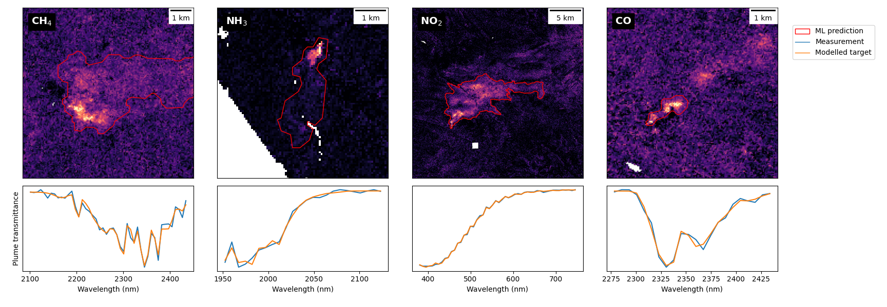

# Daily Trace Gases repository

This is the official code base for the paper "**Fully Automatic Trace Gas Plume Detection**". It allows full reconstruction of the methods we introduce to detect methane (CH<sub>4</sub>), ammonia (NH<sub>3</sub>), nitrogen dioxide (NO<sub>2</sub>) and carbon monoxide (CO) point source events. To do so, we use a three step processing pipeline. First, we compute matched filter (MF) product for each gas (either WMF or CMF variant of MF). Second, we use machine learning models from our prior research to outline plumes in the MF products. Note, that in this work, we show the first examples of zero-shot generalisation between models pre-trained on methane point source events to other trace gases. Third, we use spectral fit scoring to assign score to each ML based prediction. In our paper, we adapt spectral fitting to other explored trace gases. As we show in the associated paper, this helps us reach performance needed for fully automatic detection of methane point sources - and also greatly helps us in search for other trace gases.
Please refer to the publication for more details about the methods.

<table>
<tr align="center">
  <td width="80%"></td>
</tr>
<tr align="center">
  <td>Example detections of CH<sub>4</sub>, NH<sub>3</sub>, NO<sub>2</sub> and CO point source events (can be reproduced by commands below)</td>
</tr>
</table>

<p align="center">
  Pre-print (wip) •
  <a href="https://colab.research.google.com/github/emit-sds/daily-trace-gases/blob/master/notebooks/detect_trace_gases.ipynb">Colab Demo Notebook</a> •
  <a href="https://huggingface.co/previtus/JPL_TRACE_GASES_MODELS"> Trained models 🤗 </a>
</p>


## Important first notes

This version is attached to the submitted paper. Please always check the official repository (https://github.com/emit-sds/daily-trace-gases/) for any updates.

## Prerequisites

Clone our repository and download our machine learning models (model weights are all in total under 250MB):

```bash
# Clone the code repository
git clone https://github.com/emit-sds/daily-trace-gases/
cd daily-trace-gases
# And download the model weights:
hf download previtus/JPL_TRACE_GASES_MODELS --local-dir models/JPL_TRACE_GASES_MODELS
```

Register for the free account at the NASA's Earthdata Search (https://search.earthdata.nasa.gov/search). This will allow the code to download the L1B radiance data of EMIT.

Install the recommended python libraries (exact versions may differ depending on your machine).

```bash
# Option 1 using conda
conda create -c conda-forge -n trace_gases_env python=3.11
conda activate trace_gases_env
conda install -c conda-forge gdal
pip install -r requirements.txt
# (^ you might need specific gdal and rasterio version depending on your machine's setup)
# (^ e.g. gdal==3.7.0 rasterio==1.3.8)

# Option 2 using uv
uv sync
# (you might also need to install gdal on your machine and then) uv pip install gdal

# Option 3: run our examples on Google Colab - they include minimal library dependencies setup
```

## Example commands

We have prepared general runner script which just needs the name of the EMIT scene and target trace gas. For selection of the EMIT scene we either suggest using those reported in the paper and in the associated released datasets, search using https://search.earthdata.nasa.gov/search (it's possible to query only scenes in desired area of interest or time frame).

We currently support these options for the selection of target trace gas: `ch4, nh3, no2, co`

```bash
# Example run commands (scenes match the ones shown above):
python -m detect_trace_gas -gas "ch4" -tile "EMIT_L1B_RAD_001_20260102T143123_2600209_005"
python -m detect_trace_gas -gas "nh3" -tile "EMIT_L1B_RAD_001_20231223T123029_2335708_008"
python -m detect_trace_gas -gas "no2" -tile "EMIT_L1B_RAD_001_20250418T090845_2510806_029"
python -m detect_trace_gas -gas "co"  -tile "EMIT_L1B_RAD_001_20230623T031429_2317402_015"

# Or with uv (this might be slow first time)
uv run detect_trace_gas.py -gas "ch4" -tile "EMIT_L1B_RAD_001_20260102T143123_2600209_005"

# Check all possible parameters with:
python -m detect_trace_gas --help
```

Each run will generate the enhancement file (named as cmf.tif), and scored vector file with predictions (prediction_ensemble_scored.geojson). We recommend using software such as QGIS to inspect these. 

If you want to inspect individual steps of our pipeline, please check the code under `/pipeline`.

One thing to note is that the models used for predicting methane (`ch4`) point differs from the other trace gases. This is due to the fact that we can leverage models pre-trained on a large dataset of methane events and we also use the RGB bands from the EMIT scene. In case of other trace gases, we compute different matched filter variant and use different machine learning models (we also don't use RGB bands as that information might be gas specific).

## Related code repositories

Matched filter products:
- https://github.com/emit-sds/emit-ghg/ (CMF)
- https://github.com/UNEP-IMEO-MARS/marshsi (WMF)

Machine learning models:
- https://github.com/UNEP-IMEO-MARS/marsml-hyperspectral (HyperMARS U-Net)

Spectral fit scoring:
- https://github.com/emit-sds/plume-vetting (plume vetting for CH<sub>4</sub>)
